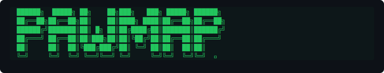

<div align="center">

<br/>



<br/>

**Stray cats already run the internet. PawMap gives them the infrastructure to run the streets too.**

**[🔥 Live at pawmap.web.app](https://pawmap.web.app)**

<br/>

[](https://nodejs.org)
[](https://www.typescriptlang.org)
[](https://react.dev)
[](https://www.mongodb.com/atlas)
[](https://socket.io)
[](https://cloud.google.com/run)
[](https://firebase.google.com)
[](LICENSE)

</div>


---

## 🗺️ The Problem

Stray cat care is **fragmented by design**. Volunteers work in silos — missing each other, duplicating effort, and losing TNR (Trap-Neuter-Return) windows. Untreated injuries go unreported. Colony sizes explode.

There's no shared view of the street.

---

## ✨ What PawMap Does

PawMap gives caregiver communities a **synchronized, live map** to coordinate stray cat welfare at the neighborhood level.

| Feature | Description |
|---|---|
| 📍 **Live Map Pins** | Report sightings, colonies, TNR sites and adopted cats on a real-time Leaflet map |
| 🔴 **Colony Alerts** | Auto-detects 3+ reports within 200m in 7 days and flags an emerging colony |
| 📸 **AI Photo Tagging** | Groq Vision (`llama-3.2-90b`) auto-tags age, coat, injuries & ear-tip status |
| 🗓️ **TNR Scheduling** | State-durable workflow engine orchestrates TNR timelines end-to-end |
| 🤝 **Volunteer Registry** | Feeders, trappers & fosters can register against any cat profile |
| 🗒️ **Cat Passports** | Full history, notes & volunteer log per cat — a permanent record |
| 🔐 **Magic Link Auth** | Passwordless email login — no friction for volunteers in the field |
| ⚡ **Real-time Sync** | Socket.io pushes map updates to all connected clients instantly |

---

## 🏗️ Architecture

```
┌──────────────────────────────────────────────────────────────┐
│                        CLIENT (React 19)                      │
│  Leaflet Map · Sidebar · ReportWizard · CatPassport · Auth   │
└──────────────────────┬───────────────────────────────────────┘
                       │ HTTP / Socket.io (ws)
┌──────────────────────▼───────────────────────────────────────┐
│                     SERVER (Express + TypeScript)             │
│                                                               │
│  ┌─────────────┐  ┌──────────────┐  ┌────────────────────┐   │
│  │  /api/auth  │  │  /api/cats   │  │  /api/tnr/schedule │   │
│  │  JWT magic  │  │  CRUD + geo  │  │  Workflow Engine   │   │
│  │  link auth  │  │  queries     │  │  (simulated)       │   │
│  └─────────────┘  └──────────────┘  └────────────────────┘   │
│                                                               │
│  ┌──────────┐  ┌────────────┐  ┌─────────┐  ┌───────────┐   │
│  │ Helmet   │  │ Mongo-     │  │  Rate   │  │ Socket.io │   │
│  │ (headers)│  │ Sanitize   │  │ Limiter │  │  (ws hub) │   │
│  └──────────┘  └────────────┘  └─────────┘  └───────────┘   │
└──────────────────────┬───────────────────────────────────────┘
                       │
          ┌────────────┴────────────┐
          │                         │
┌─────────▼──────────┐   ┌──────────▼────────────────────────┐
│  MongoDB Atlas     │   │  Groq Vision AI                    │
│  (primary store)   │   │  llama-3.2-90b-vision-preview      │
│                    │   │  ↳ Gemini 3.5 Flash (fallback)     │
│  ↳ JSON file DB    │   └────────────────────────────────────┘
│    (auto-fallback) │
└────────────────────┘
```

**Key technology decisions:**

- **Socket.io** — real-time map pin events broadcast to all connected clients
- **Groq Vision AI** — primary model for automated photo feature extraction; falls back to Gemini 3.5 Flash
- **Simulated Temporal Engine** — state-durable TNR workflow: notifies volunteers → 24h reminder → outcome prompt
- **JSON File Fallback DB** — server works fully offline without MongoDB, seeding demo data automatically
- **GCP Native** — fully automated deployment pipeline; backend on Cloud Run, frontend on Firebase Hosting

---

## 🚀 Quick Start

### Prerequisites
- Node.js ≥ 18
- MongoDB Atlas cluster (or run with built-in JSON fallback — no config needed)

```bash
# 1. Clone
git clone https://github.com/NISHANTH-KONCHADA/pawmap.git
cd pawmap

# 2. Configure environment
cp .env.example .env
# Edit .env with your credentials (see Environment Variables section below)

# 3. Install dependencies
npm install

# 4. Start development server (Vite HMR + Express backend on one port)
npm run dev
```

> 💡 **Zero-config mode**: If you skip the MongoDB URI, the server automatically falls back to a local `db.json` file pre-seeded with demo cats. Everything works out of the box.

Open [http://localhost:3000](http://localhost:3000).

---

## ⚙️ Environment Variables

Copy `.env.example` → `.env` and fill in your values:

| Variable | Required | Description | Default |
|---|---|---|---|
| `MONGODB_URI` | No | MongoDB Atlas connection string | JSON file fallback |
| `JWT_SECRET` | Yes | Secret for signing magic-link tokens | — |
| `GROQ_API_KEY` | No | Groq Vision AI key (photo analysis) | Skips AI tagging |
| `GEMINI_API_KEY` | No | Google Gemini fallback (auto-injected in AI Studio) | Skips fallback |
| `CLOUDINARY_URL` | No | Cloudinary media storage URL | — |
| `CLOUDINARY_CLOUD_NAME` | No | Cloudinary cloud name | — |
| `CLOUDINARY_API_KEY` | No | Cloudinary API key | — |
| `CLOUDINARY_API_SECRET` | No | Cloudinary API secret | — |
| `CLIENT_URL` | No | Frontend origin for CORS + Socket.io | `*` |
| `PORT` | No | Server listen port (GCP injects this) | `3000` |
| `NODE_ENV` | No | `development` or `production` | `development` |
| `SMTP_HOST` | No | SMTP host for email delivery | Console log in dev |
| `SMTP_PORT` | No | SMTP port | — |
| `SMTP_USER` | No | SMTP username | — |
| `SMTP_PASS` | No | SMTP password | — |
| `TEMPORAL_ADDRESS` | No | Real Temporal server address | Simulated engine |

---

## 📦 Scripts

```bash
npm run dev            # Start full-stack dev server (Vite HMR + Express)
npm run build          # Build Vite frontend + ESBuild server bundle
npm run build:client   # Build Vite frontend only  → dist/
npm run build:server   # ESBuild server only        → dist/server.cjs
npm run start          # Run production build (NODE_ENV=production)
npm run clean          # Remove dist/
npm run lint           # TypeScript type-check (no emit)
```

---

## ☁️ GCP Cloud Deployment

The project is configured for a fully-automated, serverless deployment using **Cloud Build**, **Cloud Run** (backend), and **Firebase Hosting** (frontend).

### One-time Setup

```bash
# 1. Enable required GCP APIs
gcloud services enable \
  cloudbuild.googleapis.com \
  run.googleapis.com \
  artifactregistry.googleapis.com \
  secretmanager.googleapis.com \
  firebasehosting.googleapis.com

# 2. Add Firebase to your GCP Project
npx firebase-tools projects:addfirebase YOUR_PROJECT_ID
npx firebase-tools hosting:sites:create pawmap --project YOUR_PROJECT_ID

# 3. Create Artifact Registry repository
gcloud artifacts repositories create pawmap \
  --repository-format=docker \
  --location=asia-south1

# 4. Store secrets in Secret Manager (never bake secrets into images)
gcloud secrets create MONGODB_URI    --data-file=- <<< "your_mongodb_uri"
gcloud secrets create JWT_SECRET     --data-file=- <<< "your_jwt_secret"
gcloud secrets create GROQ_API_KEY   --data-file=- <<< "your_groq_key"
# ... repeat for remaining secrets

# 5. Grant Cloud Build SA access to secrets & Firebase
# (Make sure to grant roles/secretmanager.secretAccessor to both Cloud Build and the Compute Engine default SA)
```

### Deploy

```bash
# Manual trigger
gcloud builds submit --config=cloudbuild.yaml
```

The `cloudbuild.yaml` pipeline automatically:
1. 🔨 Builds the multi-stage backend Docker image
2. 📤 Pushes to Artifact Registry
3. 🚀 Deploys the Express API to **Cloud Run** (secrets injected securely)
4. 🏗️ Builds the Vite frontend (`npm run build:client`)
5. 🌐 Deploys the static assets to **Firebase Hosting** (which proxies `/api` and `/socket.io` to Cloud Run via `firebase.json` rewrites)

---

## 🔒 Security

Express routes are hardened with:

| Middleware | Purpose |
|---|---|
| **Helmet** | Secure HTTP response headers |
| **Mongo-Sanitize** | Prevents NoSQL injection via request body/query |
| **Rate Limiter** | 20 POST requests per IP per 15 minutes on all write routes |
| **JWT** | Signed, expiring tokens for magic-link authentication |
| **CORS** | Scoped to `CLIENT_URL` in production |

---

## 🧩 Project Structure

```
pawmap/
├── server/
│   ├── db.ts                  # Mongoose schemas + JSON fallback DB + unified DB handler
│   ├── workflowEngine.ts      # Simulated Temporal TNR workflow runner
│   └── routes/
│       ├── auth.ts            # Magic-link generation & JWT verification
│       └── cats.ts            # Cat CRUD, geo-queries, AI photo analysis
├── src/
│   ├── App.tsx                # Root component, auth state, routing
│   ├── components/
│   │   ├── Map.tsx            # Leaflet map with real-time Socket.io pins
│   │   ├── Sidebar.tsx        # Cat list, filters & quick actions
│   │   ├── CatDetail.tsx      # Full cat profile drawer
│   │   ├── CatPassport.tsx    # Printable cat history & volunteer log
│   │   ├── ReportWizard.tsx   # Multi-step sighting report form + AI tagging
│   │   └── FilterBar.tsx      # Status / condition filters
│   ├── lib/                   # Shared utilities
│   └── index.css              # Global styles & design tokens
├── temporal/
│   ├── activities.js          # Temporal activity definitions (email, reminder)
│   ├── tnrWorkflow.js         # TNR workflow definition
│   └── worker.js              # Temporal worker bootstrap
├── server.ts                  # Express + Socket.io + Vite dev middleware entry
├── Dockerfile                 # Multi-stage production image
├── cloudbuild.yaml            # GCP Cloud Build CI/CD pipeline
├── vite.config.ts             # Vite + React + Tailwind config
└── .env.example               # Environment variable reference
```

---

## 🐾 Theme Connection

> *Stray cats already run the internet. PawMap gives them the infrastructure to run the streets too.*

Built for **#HackTheKitty 2026** — a hackathon dedicated to cats on the internet and cats in the wild.

---

<div align="center">

Made with 🐾 by the PawMap team

</div>
